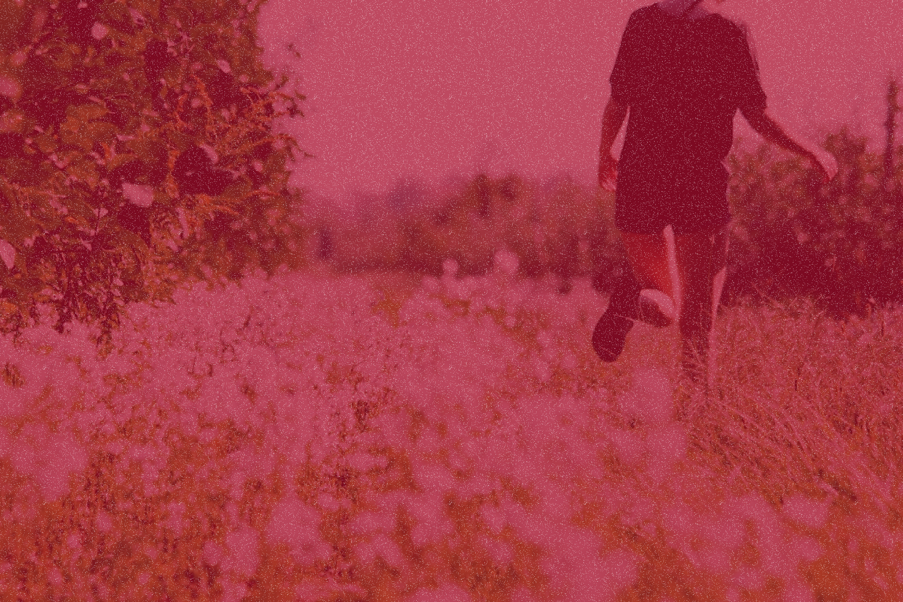

# Color-Thief-Clothes
Clothing store based on seasons. Brazilian project.
## Elements
### Name

  

  O nome foi escolhido baseado em uma música que um amigo amava. A ideia é que as estações do ano em suas representações são como polos de cores vívidas e como se a loja roubasse isso para estampar seus produtos.

### Logo

  O logo foi criada a partir da ideia da paisagens de montanhas, que são inalteradas independentes da estação. Por isso cada uma representa uma estação na paisagem em que se sobrepõem.

### Backgrounds

  
  

  
  

  Os backgrounds foram escolhidos a dedo para representarem momentos especiais nessa passagem de estações, mostrando a importância de estar bem vestido.

